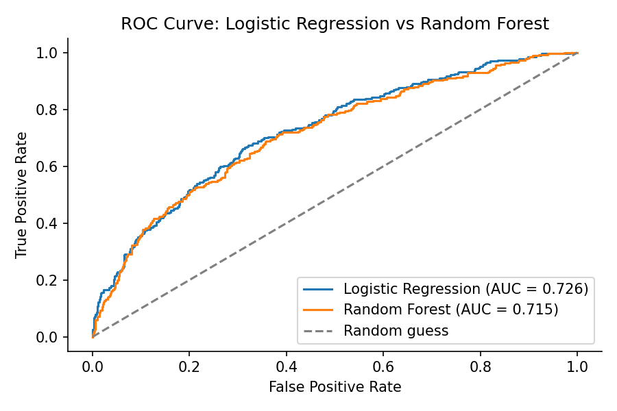
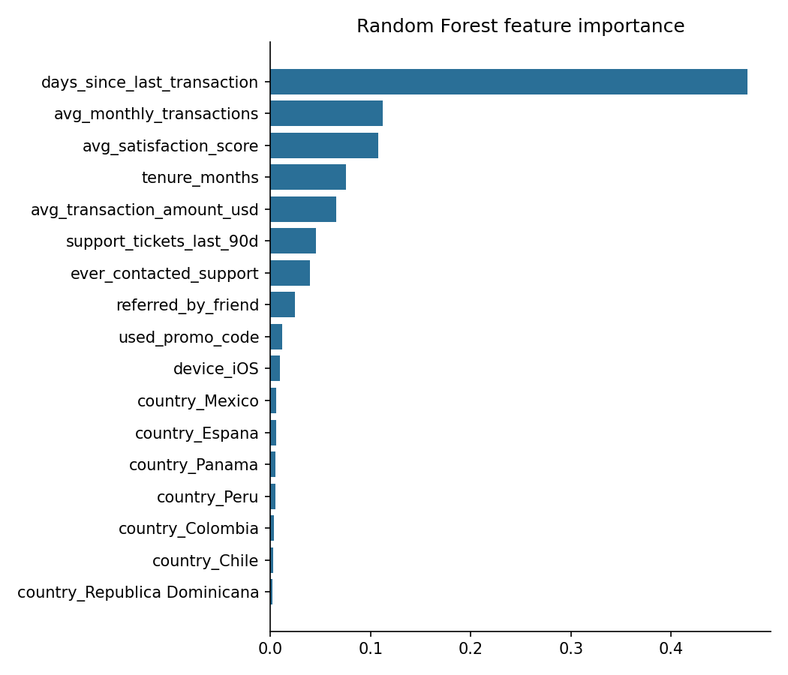

# Customer Churn Prediction (ML)


## Overview
Predictive analytics project to identify customers of a fintech remittance
app who are likely to churn (stop sending transfers), and to understand
which factors actually drive that risk. The project covers exploratory
data analysis, feature engineering, two classification models (logistic
regression and random forest), evaluation with imbalance-aware metrics,
and a translation of the model's feature importance into concrete
retention recommendations.

All data used in this project is synthetic, generated to reflect a
realistic churn pattern (recency of use, support friction, tenure and
engagement as the main drivers) without exposing any real company or
user data.

## Business definition of churn
A customer is considered churned if they were previously active but sent
no transfer in the last 60 days as of the reference date. Churn rate in
this dataset is **17.8%**, a realistic and meaningfully imbalanced target.

## Features
- Exploratory data analysis with class balance check, boxplots by churn
  status and a correlation matrix
- Feature engineering that treats "never contacted support" as meaningful
  information, instead of just filling missing values with the column
  mean
- Baseline Logistic Regression (interpretable coefficients) and a Random
  Forest model, both trained with class-weight balancing for the churn
  imbalance
- Evaluation with precision, recall, F1, ROC-AUC, confusion matrices and
  precision-recall curves, since accuracy alone is misleading on an
  imbalanced target
- Feature importance translated into specific retention actions, not just
  reported as a chart
- Explicit discussion of data leakage risk and other methodological
  limitations

## Technologies
- Python (pandas, numpy)
- Scikit-Learn (Logistic Regression, Random Forest, model evaluation)
- Matplotlib for visualization
- Jupyter Notebook

## Workflow
- Simulate a realistic churn dataset (`data/customer_churn_data.csv`)
- Explore the data: class balance, feature distributions by churn status,
  correlations
- Engineer features (support-contact flag, missing value handling,
  categorical encoding) and split into train/test sets, stratified on churn
- Train a Logistic Regression baseline and a Random Forest model
- Evaluate both with metrics appropriate for an imbalanced classification
  problem
- Extract feature importance and turn it into retention recommendations

## Results
- **Logistic Regression:** ROC-AUC 0.726, recall on churned class 0.63
- **Random Forest:** ROC-AUC 0.715, recall on churned class 0.55
- The untuned Random Forest does not outperform the simpler Logistic
  Regression here, a useful reminder that model complexity isn't
  automatically better without tuning
- **Top churn drivers:** days since last transaction (by far the
  strongest), support ticket volume, and low tenure combined with low
  transaction frequency
- **Recommendation:** trigger re-engagement before the 60-day churn
  threshold is reached, treat recent support tickets as a retention risk
  signal, and focus retention effort on newer, less engaged customers




## Project Purpose
The objective of this project was to build a churn model the right way
for a portfolio piece: correctly diagnosing and accounting for class
imbalance, comparing a simple and a complex model instead of assuming the
complex one wins, and using the model's feature importance to produce
actionable retention recommendations rather than stopping at a prediction
score.

## Getting Started
```bash
pip install -r requirements.txt
jupyter notebook notebooks/Churn_Prediction_Analysis.ipynb
```
The notebook is already executed and saved with its outputs, so it can
also just be read directly on GitHub without running anything.

## Repository Contents
```
├── data
│   ├── customer_churn_data.csv
│   └── README.md
│
├── notebooks
│   ├── Churn_Prediction_Analysis.ipynb
│   └── README.md
│
├── images
│   ├── roc_curve.png
│   └── feature_importance.png
│
└── README.md
```

## Author

Jorge Lozano


